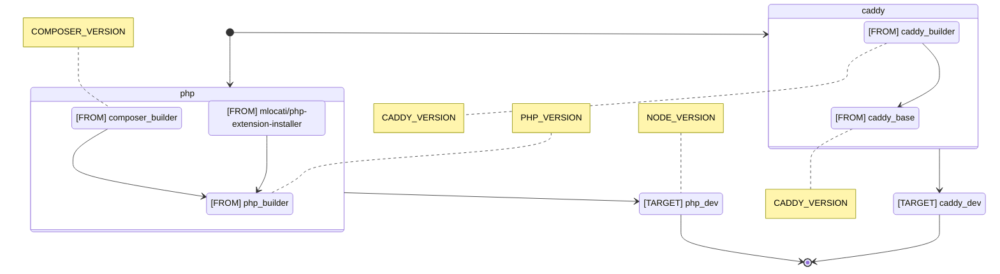
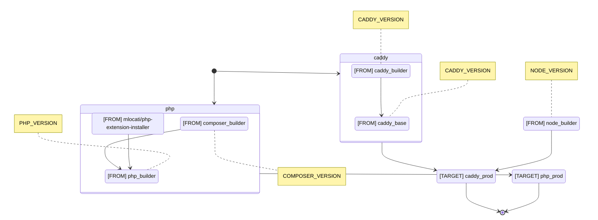

# 🚀 Symfony Sail

Like the name suggest, inspired by Laravel Sail, this is a complete **development and production ready environment** for Symfony 6 projects, based on Docker containers.

> This project is largely inspired by the great work of [dunglas/symfony-docker](https://github.com/dunglas/symfony-docker) (thank you for that). It comes with less feature but it should be easier to use for most users. And includes Node.js, because... why not?

## ⚙️ Controlling the environment

> **Note**: other environment files like `.env.local` are **not** taken into account. Only the main file is used.

The build args (that is, the environment) can be change setting variables in the `.env` file:

| Variable             | Allowed values                       | Default value       |
| :------------------- | :----------------------------------- | :-----------------: |
| `CADDY_VERSION`      | `x`, `x.y`, `x.y.z`                  | `2`                 |
| `COMPOSER_VERSION`   | `latest`, `lts`, `x`, `x.y`, `x.y.z` | `latest`            |
| `NODE_VERSION`       | `current`, `lts`, `x`                | `lts`               |
| `PHP_VERSION`        | `x`, `x.y`, `x.y.z`                  | `8.2`               |

Other options:

| Variable             | Allowed values                       | Default value       |
| :------------------- | :----------------------------------- | :-----------------: |
| `CADDY_ADMIN_OPTION` | Caddy global `admin` option          | *Environment based* |
| `CADDY_DEBUG_OPTION` | Caddy global `debug` option          | *Environment based* |

## 🐋 Docker internals

Project [`Dockerfile`](Dockerfile) is a [multi-stage build](https://docs.docker.com/build/building/multi-stage/) where multiple `FROM` statements are used in order to build the final artifact(s).

### Development environment flow

The development flow involves two Docker compose files:

- [`docker-compose.yml`](docker-compose.yml)
- [`docker-compose.dev.yml`](docker-compose.dev.yml)

> **Note**: Both files are loaded automatically by Visual Studio Code dev [container descriptor](.devcontainer/devcontainer.json).

### Production environment flow

The production flow involves two Docker compose files:

- [`docker-compose.yml`](docker-compose.yml)
- [`docker-compose.override.yml`](docker-compose.override.yml)

> **Note**: Docker compose will load both files automatically. In other words, there is no need to specify `-f` when calling `docker compose`.

